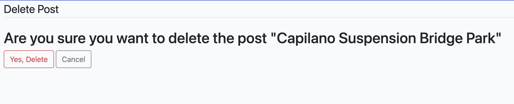

# Scenic Destinations
Scenic Destinations is a travel blog website that allows users to view blogs of other users who have traveled to destinations around the world. The website also also a new user to register for a profile account. Once approved, they will have the opportunity to post their own blog, comment on existing posts, update and delete their posts and comments and also to like or unlike a post. When a user is not signed in, they can only view the list of posts.

Visit the deployed website: [Scenic Destinations](https://scenic-destinations.herokuapp.com/).

## Table of Contents
1. [User Experience (UX)](#user-experience-UX)
    1. [Project Goals](#project-goals)
    2. [User Stories](#user-stories)
    3. [Colour Scheme](#colour-scheme)

2. [Features](#features)
    1. [Current Features](#current-features)
    2. [Future Features](#future-features)
3. [Technologies Used](#technologies-used)
    1. [Language Used](#language-used)
    2. [Programs Used](#programs-used)
    
4. [Testing](#testing)
    1. [Testing User Stories](#testing-user-stories)
    2. [Code Validation](#code-validation)
    3. [Manual Testing](#manual-testing)

5. [Deployment](#deployment)

6. [Cloning](#cloning)

7. [Credits](#credits)

8. [Acknowledgements](#acknowledgements)

## User Experience (UX)
### Project Goals
The goal of the website was to design and create and informative, interactive and fun website. Offering users knowledge about Scenic Destination locations around the world. The website contains our company logo "Scenic Destinations", "Home" "Login" & "Register", which are linked to additional pages on the site. Each page has a matching banner/header page and also a matching footer page. The footer includes social media links that open in separate links for their respective sites. The colour of each social link will change to green and increase in size on a hover action.

### User Stories
User Stories are demonstrated in the manual testing section below.

[User Stories](https://github.com/gregcotech007/scenic-destinations/projects/1)

- As a Site User, I can view a paginated list of posts so that I can select which post to view.
- As a Site User, I can view a list of posts so that I can select one to read.
- As a Site User, I can click on a post so that read the full text.
- As a Site User / Admin, I can view the number of likes on each post so that I can see which post is the most popular or viral.
- As a Site User / Admin, I can view comments on an individual post so that I can be involved in the conversation.
- As a Site User, I can register an account so that I can comment and like.
- As a Site User, I can leave comments on a post so that I can be involved in the conversation.
- As a Site User, I can like or unlike a post so that I can interact with the content.
- As a Site Admin, I can create, read, update and delete posts so that I can manage my blog content.
- As a Site Admin, I can create draft posts so that I can finish writing the content later.
- As a Site Admin, I can approve or disapprove comments so that I can filter out objectionable comments.

### Colour Scheme
[Coolours](https://coolors.co/)
#### Here are the colours being used:

  
Coolers Colour Pallette 1

    - #F9FAFC - Cultured
    - #4A4A4F - Dark Liver 
    - #FFFFFF - White 
    - #445261 - Charcoal

  
Coolers Colour Pallette 2

    - #14AA71 - Jade
    - #E84610 - Flame 
    - #23BBBB - Maximum Blue Green
    - #2749DE - Blue RYB

### Typography
[Google Fonts](https://fonts.google.com/) is used across the entire site.
Roboto & Lato are the two fonts that has been chosen to use across the site. 

### Wireframes
Wireframes were created for the different device types as follows:

  
Mobile Wireframe

  

  
Tablet Wireframe

  

  
Desktop Wireframe

  

[Back to top ⇧](#scenic-destinations)

## Features

### Current Features

<table>
    <tr>
        <th>Feature</th>
        <th>Description</th>
    </tr>
    <tr>
        <td>Favicon</td>
        <td>The favicon image was selected as the company logo image. The favicon is visible in the browser tab and search engine history. It adds a unique identifier to the site.</td>
    </tr>
        <tr>
        <td>Homepage Image</td>
        <td>The Homepage is the landing page that user will arrive at on the website. It consists of a company logo, links for "Home, Login, Register" at the top. It also has 6 posts per page and posts are paginated onto additional pages. It also consists of a footer with external links to social media sites.</td>
    </tr>
    <tr>
        <td>Header</td>
        <td>The header is fixed at the top of the page. The colour choice of #2749DE - Blue RYB was used with white text which is easily ready. It also consists of company logo.</td>
    </tr>
    <tr>
        <td>Footer</td>
        <td>The footer also includes the same colour scheme as the header. The footer contains social media links, on-hover over links, the icon increases in size and changes colour to green.</td>
    </tr>
    <tr>
        <td>Site Navigation</td>
        <td>The site navigation bar will change depending on user status. If logged in, the navigation displays "Home, Add Post, Profile, Logout" </td>
    </tr>
    <tr>
        <td>Post View</td>
        <td>The favicon image was selected as the company logo image. The favicon is visible in the browser tab and search engine history. It adds a unique identifier to the site.</td>
    </tr>
</table>

### Future Features

## Technologies Used

### Language Used
* [HTML 5](https://en.wikipedia.org/wiki/HTML5)
* [CSS 3](https://en.wikipedia.org/wiki/CSS)
* [JavaScript](https://en.wikipedia.org/wiki/JavaScript)

### Programs Used
* [GitPod](https://gitpod.io/) was used for writing code and pushing to main on GitHub.
* [GitHub](https://github.com/) was used to store the project after pushing the code.
* [Coolours](https://coolors.co/) library was used to apply colour to the website. 
* [Balsamiq](https://balsamiq.com/wireframes/) was used to create and design the mobile, tablet and desktop wireframes.

[Back to top ⇧](#scenic-destinations)

## Testing

### Code Validation
[W3C HTML Validation](https://validator.w3.org/#validate_by_input)

[W3C CSS Validation](https://jigsaw.w3.org/css-validator/#validate_by_input)

[CI Python Linter - Pep8](https://pep8ci.herokuapp.com/)

<table>
    <tr>
        <th>Resource Used</th>
        <th>Code Tested</th>
        <th>Example</th>
        <th>Pass/Fail</th>
    </tr>
    <tr>
        <td>W3C HTML Validation</td>
        <td>style.css</td>
        <td></td>
        <td>Pass</td>
    </tr>
    <tr>
        <td>HTML Checker</td>
        <td>home.html</td>
        <td></td>
        <td>Pass</td>
    </tr>
    <tr>
        <td>HTML Checker</td>
        <td>login.html</td>
        <td></td>
        <td>Pass</td>
    </tr>
    <tr>
        <td>HTML Checker</td>
        <td>post_form.html</td>
        <td></td>
        <td>Pass</td>
    </tr>
    <tr>
        <td>HTML Checker</td>
        <td>post_detail.html</td>
        <td></td>
        <td>Pass</td>
    </tr>
    <tr>
        <td>HTML Checker</td>
        <td>profile.html</td>
        <td></td>
        <td>Pass</td>
    </tr>
    <tr>
        <td>Pep8 Validator</td>
        <td>blog/admin.py</td>
        <td></td>
        <td>Pass</td>
    </tr>
    <tr>
        <td>Pep8 Validator</td>
        <td>blog/apps.py</td>
        <td></td>
        <td>Pass</td>
    </tr>
    <tr>
        <td>Pep8 Validator</td>
        <td>blog/forms.py</td>
        <td></td>
        <td>Pass</td>
    </tr>
    <tr>
        <td>Pep8 Validator</td>
        <td>blog/models.py</td>
        <td></td>
        <td>Pass</td>
    </tr>
    <tr>
        <td>Pep8 Validator</td>
        <td>blog/urls.py</td>
        <td></td>
        <td>Pass</td>
    </tr>
        <tr>
        <td>Pep8 Validator</td>
        <td>blog/view.py</td>
        <td></td>
        <td>Pass</td>
    </tr>
    <tr>
        <td>Pep8 Validator</td>
        <td>users/admin.py</td>
        <td></td>
        <td>Pass</td>
    </tr>
    <tr>
        <td>Pep8 Validator</td>
        <td>users/apps.py</td>
        <td></td>
        <td>Pass</td>
    </tr>
    <tr>
        <td>Pep8 Validator</td>
        <td>users/forms.py</td>
        <td></td>
        <td>Pass</td>
    </tr>
    <tr>
        <td>Pep8 Validator</td>
        <td>users/models.py</td>
        <td></td>
        <td>Pass</td>
    </tr>
    <tr>
        <td>Pep8 Validator</td>
        <td>users/signals.py</td>
        <td></td>
        <td>Pass</td>
    </tr>
        <tr>
        <td>Pep8 Validator</td>
        <td>users/view.py</td>
        <td></td>
        <td>Pass</td>
    </tr>
</table>

### Lighthouse Testing
The site was also tested for the Lighthouse Performance Score and the results were as follows:

  
Lighthouse Testing - Mobile

  

  
Lighthouse Testing - Desktop

  

### Manual Testing
<table>
    <tr>
        <th>Feature Tested</th>
        <th>Testing Method</th>
        <th>Example</th>
        <th>Pass/Fail</th>
    </tr>
    <tr>
        <td>Homepage</td>
        <td>Enter homepage address in browser and test all links</td>
        <td></td>
        <td>Pass</td>
    </tr>
    <tr>
        <td>Login - Blank Fields</td>
        <td> Each sign-in field left blank and submitted, to ensure error message appeared.</td>
        <td>></td>
        <td>Pass</td>
    </tr>
    <tr>
        <td>Login - Incorrect Username Field</td>
        <td>Tested with incorrect spelling.</td>
        <td></td>
        <td>Pass</td>
    </tr>
    <tr>
        <td>Login - Incorrect Password Field</td>
        <td>Tested with incorrect spelling and capitalisation to verify account security.</td>
        <td></td>
        <td>Pass</td>
    </tr>
    <tr>
        <td>No Logged-in User - Like Button</td>
        <td>Like button is not activated.</td>
        <td></td>
        <td>Pass</td>
    </tr>
    <tr>
        <td>No Logged-in User - Comments</td>
        <td>Comment box is not available to post comment on post.</td>
        <td></td>
        <td>Pass</td>
    </tr>
    <tr>
        <td>No Logged-in User - Add Post</td>
        <td>No option to Add post.</td>
        <td></td>
        <td>Pass</td>
    </tr>
    <tr>
        <td>Logged-in User - Add Post</td>
        <td>Add Post option displayed in navbar.</td>
        <td></td>
        <td>Pass</td>
    </tr>
    <tr>
        <td>Logged-in User - Like Button</td>
        <td>Like button is activated on post.</td>
        <td></td>
        <td>Pass</td>
    </tr>
    <tr>
        <td>Logged-in User - Comment Box</td>
        <td>Can leave comment on post and submit for Admin approval.</td>
        <td></td>
        <td>Pass</td>
    </tr>
    <tr>
        <td>Logged-in User - Add Post</td>
        <td>Add post without image, displays default image.</td>
        <td></td>
        <td>Pass</td>
    </tr>
    <tr>
        <td>Logged-in User - Add Post</td>
        <td>Add Post with image, displays default image.</td>
        <td></td>
        <td>Pass</td>
    </tr>
    <tr>
        <td>Logged-in User - Update Post</td>
        <td>Update Post as author. Only author of post can update it.</td>
        <td></td>
        <td>Pass</td>
    </tr>
    <tr>
        <td>Logged-in User - Delete Post</td>
        <td>Delete post as author. Only author of post can delete it. Are you sure you want to delete?</td>
        <td></td>
        <td>Pass</td>
    </tr>
    <tr>
        <td>Registration - Invalid Email Field</td>
        <td>Invalid email was tested to ensure error message appeared.</td>
        <td></td>
        <td>Pass</td>
    </tr>
    <tr>
        <td>Registration - Common Password</td>
        <td>A common password was tested to check security.</td>
        <td></td>
        <td>Pass</td>
    </tr>
    <tr>
        <td>Registration - Short Password</td>
        <td>A short password was tested for error message when using less than 8 characters.</td>
        <td></td>
        <td>Pass</td>
    </tr>
</table>

[Back to top ⇧](#scenic-destinations)

## Deployment

### GitHub
The website has been deployed using GitHub Pages by following these steps:
1. Confirmed that correct repository name is selected as: 'scenic-destinations'
2. Select 'Settings'
3. Scroll down to 'GitHub Pages' and click on 'Check it out here!'
4. On the 'Source' section, select Branch as 'main' and click on 'Save'.
5. Your site is published at https://scenic-destinations.herokuapp.com/
### Gitpod
1. For deployment of the website to a local environment, the following steps were required:
2. Confirmed that correct repository is selected as 'scenic-destinations'
3. To run a new Python server, open a terminal window and type the following code and hit enter:
    - python3 mange.py runserver
4. Once the Python server is running, you will be prompted to open a browser on port 8000 to show the output.

[Back to top ⇧](#scenic-destinations)

## Cloning
To clone a copy of the code in the repository, the following steps are required:
- Go to https://github.com and select the Repository called ‘scenic-destintions'
- Click on the button called 'Code" and a pop-out window will show options to Clone through:
    - HTTPS
    - SSH
    - GitHub CLI
1. On GitHub.com, navigate to the main page of the repository.
2. Above the list of files, click  Code.
3. To clone the repository using HTTPS, under "Clone with HTTPS", click 'Clipboard to copy'. To clone the repository using an SSH key, including a certificate issued by your organization's SSH certificate authority, click Use SSH, then click 'Clipboard to copy'. To clone a repository using GitHub CLI, click Use GitHub CLI, then click 'Clipboard to copy'.
4. Open Terminal.
5. Change the current working directory to the location where you want the cloned directory.
6. Type > git clone and then paste the URL you copied earlier. 
    > $ git clone https://github.com/YOUR-USERNAME/YOUR-REPOSITORY
7. Press Enter to create your local clone.
    > $ git clone https://github.com/YOUR-USERNAME/YOUR-REPOSITORY
    > Cloning into `Spoon-Knife`...
    > remote: Counting objects: 10, done.
    > remote: Compressing objects: 100% (8/8), done.
    > remove: Total 10 (delta 1), reused 10 (delta 1)
    > Unpacking objects: 100% (10/10), done.
8. Repository Clone is now complete.

[Back to top ⇧](#scenic-destinations)

## Credits
### Code
* The Code Institute's **Hello Django**, **I think Therefore I Blog** and **Boutique Ado** walkthroughs were all used to assist in the project. 
### Content
* The 'Roboto' and "Lato" fonts were used from [Google Fonts](https://fonts.google.com/).
* The website icons were used from [Font Awesome](https://fontawesome.com/).
* Bootstrap CSS was used for styling from [Bootstrap CSS](https://getbootstrap.com/).
### Media
The Post Resources used:
-   Skellig Michael
    - Text: [Heritage Ireland](https://heritageireland.ie/places-to-visit/skellig-michael/).
    - Image: [Pixabay](https://pixabay.com/photos/ireland-skellig-island-atlantic-4533681/).
-   Cliffs of Moher
    - Text: [Cliffs of Moher](https://www.cliffsofmoher.ie/about-the-cliffs-of-moher).
    - Image: [Pixabay](https://pixabay.com/photos/cliff-of-moher-ireland-cliffs-coast-2371819/).
-   Moraine Lake, Canada
    - Text: [Government of Canada](https://parks.canada.ca/pn-np/ab/banff/visit/les10-top10/louise).
    - Image: [Pixabay](https://pixabay.com/photos/moraine-lake-mountains-lake-2686353/).
-   Uluru, NT, Australia
    - Text: [Uluru-Kata Tjuta National Park](https://parksaustralia.gov.au/uluru/).
    - Image: [Pixabay](https://pixabay.com/photos/uluru-australia-monolith-2058380/).
-   Hoover Dam
    - Text: [Bureau of Reclamation](https://www.usbr.gov/lc/hooverdam/service/index.html).
    - Image: [Pixabay](https://pixabay.com/photos/hoover-dam-colorado-river-nevada-3780254/).
-   Grand Canyon
    - Text: [National Park Arizona](https://www.nps.gov/grca/index.htm).
    - Image: [Pixabay](https://pixabay.com/photos/grand-canyon-usa-national-park-1235221/).
-   Whitsundays
    - Text: [The Whitsundays](https://www.queensland.com/au/en/places-to-see/destinations/the-whitsundays).
    - Image: [Pixabay](https://pixabay.com/photos/whitsunday-island-great-barrier-reef-796006/).
-   Aillwee Caves
    - Text: [Discover Ireland](https://www.discoverireland.ie/clare/aillwee-cave-the-birds-of-prey-centre).
    - Image: [Aillwee Burren Experience](https://aillweeburrenexperience.ie/ailwee-cave-the-burren/#&gid=1&pid=2).
-   Capilano Suspension Bridge Park
    - Text: [Capbridge](https://www.capbridge.com/events/canyon-lights/).
    - Image: [Capbridge](https://www.capbridge.com/events/canyon-lights/).

### Other
* The wireframes for the project were designed and created using [Balamiq](https://balsamiq.com/wireframes/).
* The mockup of the website on different devices in the README.md was created using [Am I Responsive?](https://ui.dev/amiresponsive).

[Back to top ⇧](#scenic-destinations)

## Acknowledgements
* I would like to thank Code Institute for providing me access to the course content, Tutor Support, Student Support and our course co-ordinator.
* I would also like to thank my Mentor Rohit, for all their help and support throughout.
* I would like to thank my fellow students, who together as a team, supported each other, throughout the journey.

[Back to top ⇧](#scenic-destinations)
